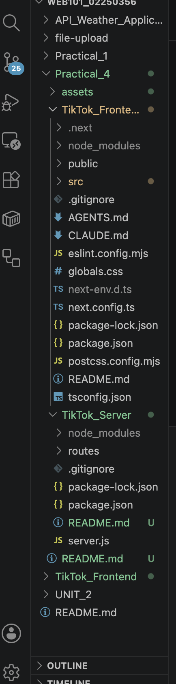
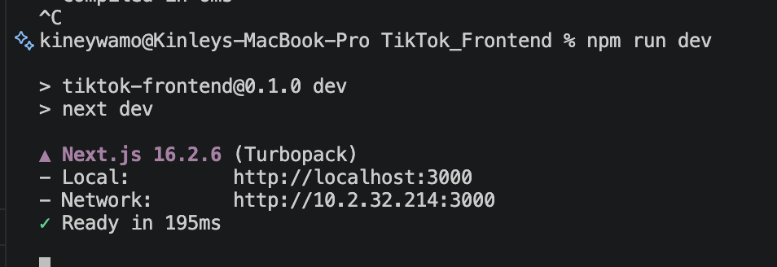
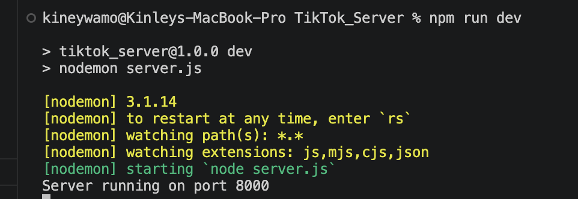
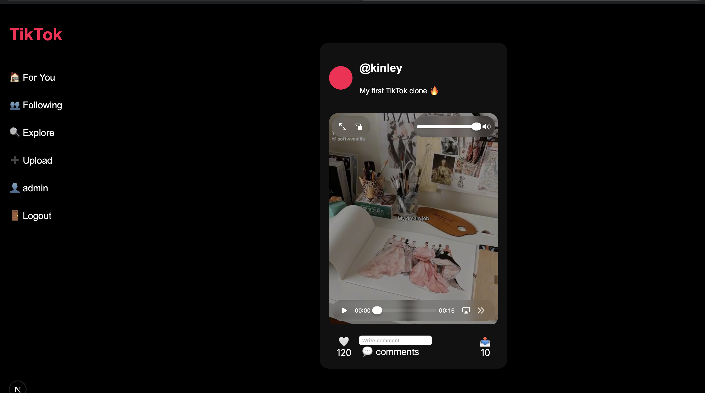
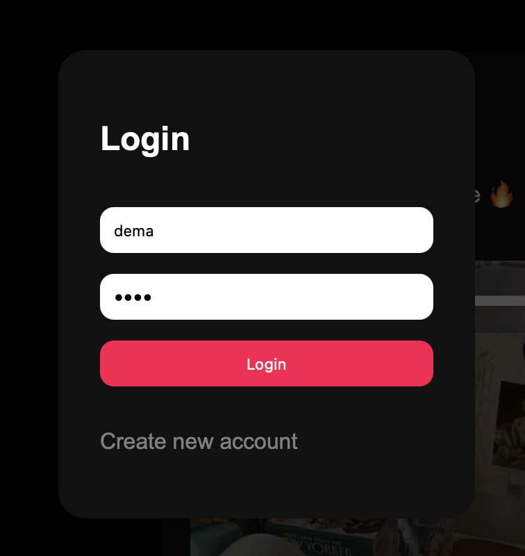
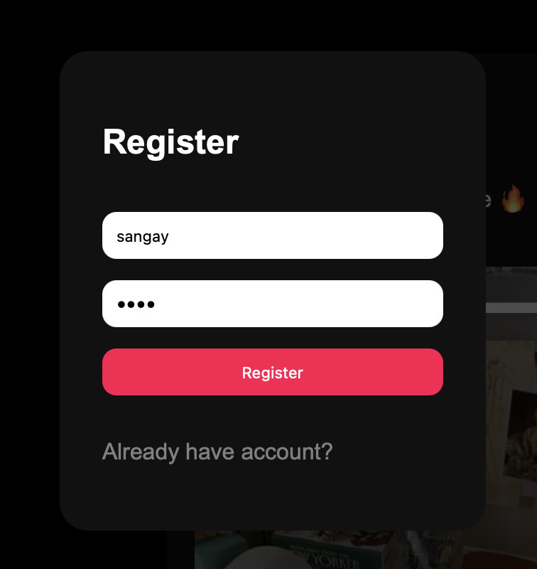

# TikTok Clone Full-Stack Application

##  Project Overview

This project is a full-stack TikTok Clone developed for WEB101. It includes a frontend built with Next.js and a backend server built with Express.js.

The application simulates a TikTok-style social media platform with video feeds, user authentication, likes, comments, and API integration.

---

##  Project Structure



---

# Frontend (TikTok_Frontend)

Built using:

- Next.js
- React.js
- Axios
- React Hooks
- CSS

## Features

- TikTok-style UI
- Video feed
- Video player
- Login/Register modal
- Like system
- Comment system
- Share functionality
- Sidebar navigation

Runs on:

``` id="h63ohw"
http://localhost:3000
```

---

#  Backend (TikTok_Server)

Built using:

- Node.js
- Express.js
- Nodemon
- CORS

## Features

- REST API server
- Users API
- Videos API
- Frontend-backend communication
- JSON data handling

Runs on:

``` id="tvmyvl"
http://localhost:8000
```

---

# Installation Steps

##  Clone Repository

```bash id="zaj0ln"
git clone <repository-url>
```

---

##  Frontend Setup

```bash id="18avt4"
cd TikTok_Frontend
npm install
npm run dev
```

---

##  Backend Setup

Open another terminal:

```bash id="nh6bwb"
cd TikTok_Server
npm install
npm run dev
```

---

## API Endpoints

## Users API

``` id="7m79gf"
GET /api/users
```

---

## Videos API

``` id="jlwm0m"
GET /api/videos
```

---

## Screenshots

* Frontend Running


* Backend running


* Home page


* Login page


* Register page


## Frontend
- Home page
- Login modal
- Video feed
- Like/comment interaction

## Backend
- Terminal running server
- API responses

---

##  Learning Outcomes

- Built a full-stack web application
- Implemented frontend and backend communication
- Created REST APIs using Express.js
- Used React Hooks for state management
- Designed responsive UI components
- Managed project structure using Git and GitHub
